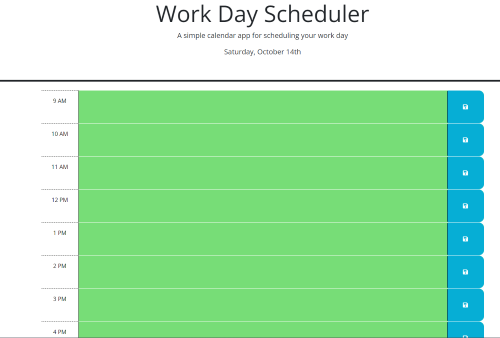

# Schedule Planner

https://thaodev23.github.io/schedule-planner/

https://github.com/Thaodev23/schedule-planner

## User Story

```
AS AN coding bootcamp student
I WANT to make a calendar to help organize my class events
SO THAT I can use up my time in an effective measure
```

## Acceptance Criteria

```
GIVEN I have create a schedule for my busy class work
WHEN I need to lay out a plan for my class work
THEN I am presented with an ideal schedule 
WHEN I need to put specific tasks to a certain time
THEN I am presented with time-blocks that can perform that job
WHEN I want to see whether if the tasks in the time-blocks is past, present or future
THEN the time-blocks will be color coded to indicate that measure
WHEN I input data into the time-blocks
THEN the data will be save in the local storage
WHEN I input the data into the time-blocks
THEN the data will be saved in the time-blocks even if I refresh the web page

```

## Image

Below: Image of the schedule to plan out the class works.

<!--  -->


## Collaborators

```
Jason Yang:
Github profile - https://github.com/Jasony95
Classmate that collaborated on the homework assignment together.
 ```

```
Sichoun Nplhaib Lee:
Github profile - https://github.com/DDXP3.
Classmate that collaborated on the homework assignment together.
```
